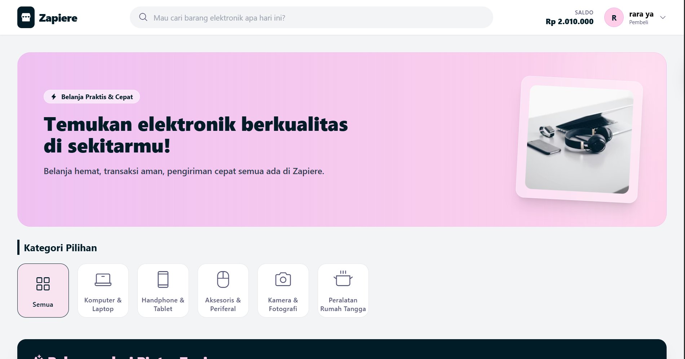
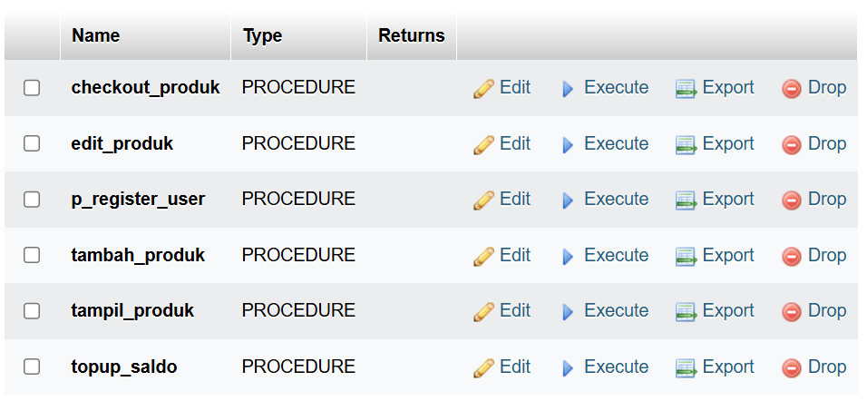
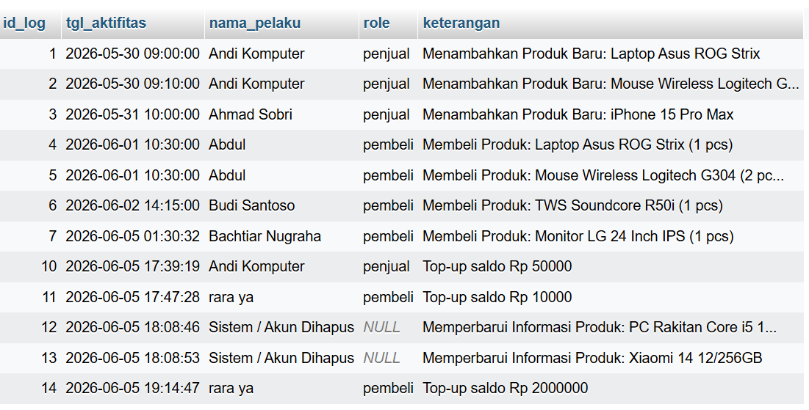
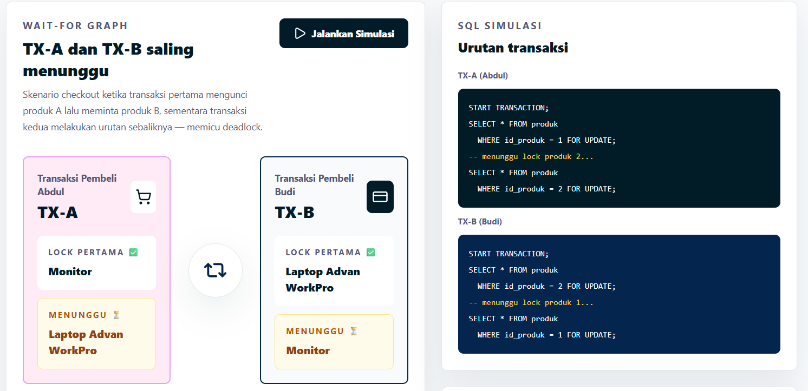
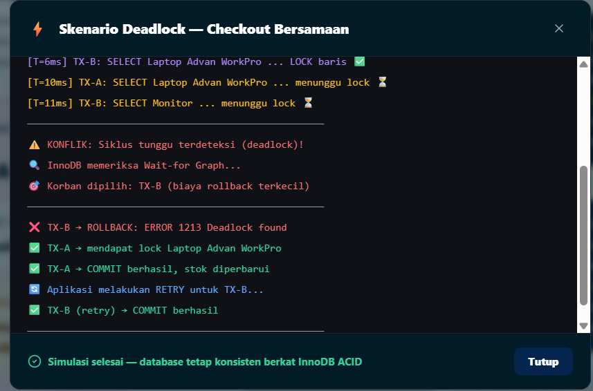
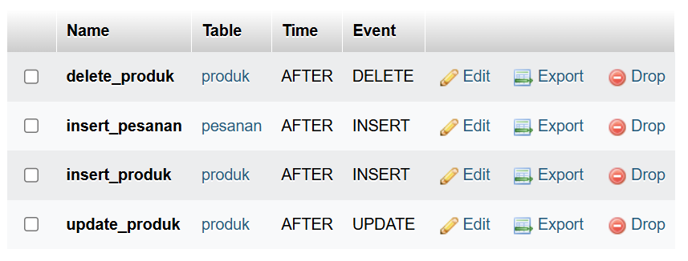
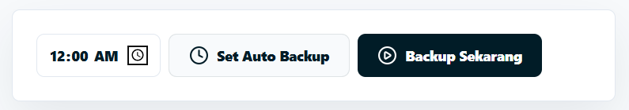
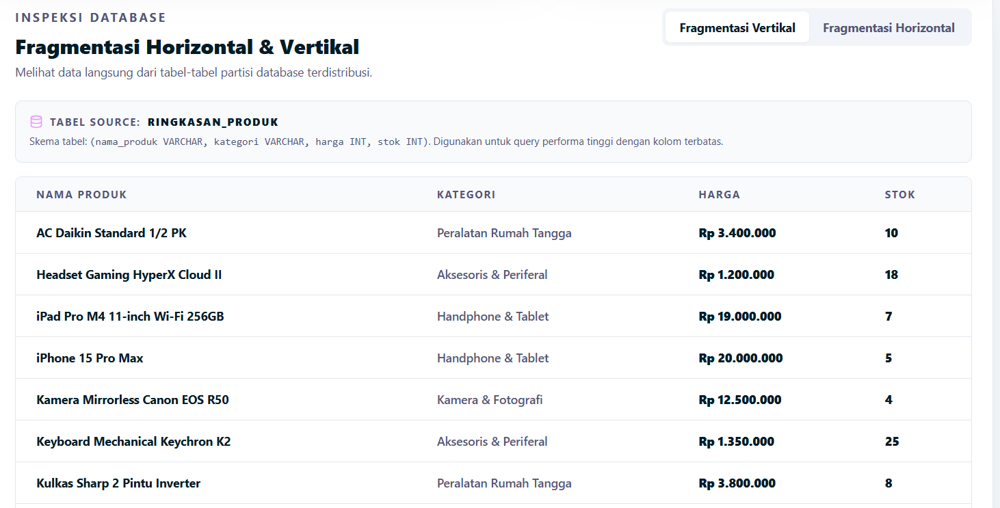

# 🛒 ZAPIERE (Proyek UAP)

ZAPIERE merupakan platform **e-commerce marketplace** yang dibangun menggunakan **PHP** dan **MySQL**. Sistem ini dirancang untuk menghubungkan penjual dan pembeli dalam satu ekosistem digital yang terintegrasi dengan memanfaatkan fitur-fitur lanjutan DBMS seperti **Stored Procedure**, **Function**, **Database View**, **SQL JOIN & SET OPERATION**, **Trigger**, **Transaction**, **Backup & Monitoring Infrastruktur**, serta **Fragmentasi**. Zapiere juda terdapat fitur **Deadlock Simulation** untuk  mensimulasikan deadlock yang dapat terjadi pada sistem.

Selain menyediakan fitur marketplace seperti pengelolaan produk, keranjang belanja, dan transaksi pembelian, sistem ini juga menerapkan mekanisme otomatisasi database untuk menjaga konsistensi data, keamanan transaksi, serta pencatatan aktivitas pengguna melalui audit trail.



<h1>📌 Detail Konsep</h1>
Beberapa implementasi Stored Procedure, Function, Database View, SQL Join & Set Operation, Deadlock Simulation, Trigger, Backup, dan Fragmentasi yang digunakan pada sistem ZAPIERE adalah sebagai berikut:

## 🛍️ checkout_produk - Stored Procedure & Transaction

Stored Procedure ini digunakan untuk menangani proses checkout produk dari keranjang belanja dalam satu transaksi database.

Procedure ini akan:

* Memeriksa ketersediaan stok produk.
* Memvalidasi saldo pengguna.
* Membuat data pesanan.
* Mengurangi stok produk.
* Memindahkan saldo pembeli ke penjual.
* Menjalankan `COMMIT` jika seluruh proses berhasil.
* Menjalankan `ROLLBACK` jika terjadi kegagalan.

**Contoh Pemanggilan Procedure**

```php
$stmt = mysqli_prepare($conn, "CALL checkout_produk(?)");
mysqli_stmt_bind_param($stmt, "i", $id_user);
mysqli_stmt_execute($stmt);
```

---

## 🧮 f_total_bayar_pesanan & f_total_omzet_penjual

Function `f_total_bayar_pesanan` ini digunakan untuk menghitung total pembayaran pesanan berdasarkan data produk dan jumlah pembelian yang tersimpan pada database.

Function ini dimanfaatkan untuk:

* Mengurangi perhitungan manual pada PHP.
* Menjaga konsistensi nilai total pembayaran.
* Mendukung pembuatan laporan dan view.

**Contoh Pemanggilan Function**

```sql
SELECT f_total_bayar_pesanan(id_pesanan);
```

---

Sedangkan function `f_total_omzet_penjual` digunakan untuk melakukan transformasi data dan kalkulasi langsung di query, menghemat pemrosesan di sisi aplikasi.

```sql
BEGIN
    DECLARE v_total INT DEFAULT 0;
    SELECT COALESCE(SUM(dp.jumlah * p.harga), 0) INTO v_total
    FROM detail_pesanan dp
    JOIN produk p ON dp.id_produk = p.id_produk
    JOIN pesanan ps ON dp.id_pesanan = ps.id_pesanan
    WHERE p.id_user = p_id_user;
    
    RETURN v_total;
END
```

---

## 🔗 SQL Join & Set Operations
UNION digunakan untuk menggabungkan hasil dari dua atau lebih perintah SELECT menjadi satu hasil akhir secara vertikal. Di Zapiere, operasi himpunan ini digunakan untuk memberikan label promosi berdasarkan kriteria stok dan harga barang.

**Contoh Implementasi**

```sql
SELECT id_produk, nama, harga, foto_barang, '🚨 Sisa Dikit!' AS label_promo 
FROM produk 
WHERE stok <= 5 AND stok > 0

UNION ALL

SELECT id_produk, nama, harga, foto_barang, '💎 Premium' AS label_promo 
FROM produk 
WHERE harga >= 15000000;
```

---

Sedangkan SQL Join digunakan untuk menggabungkan tabel satu sama lain untuk memperoleh semua data dari banyak tabel dan saling terintegrasi


Join antara Tabel Produk, Kategori, dan User
---

## 👁️ View : v_log_aktifitas


Untuk memfasilitasi halaman pemantauan admin, dibangun sebuah View (v_log_aktifitas) yang mengenkapsulasi kueri kompleks dengan LEFT JOIN dan fungsi COALESCE. View ini memastikan integritas data riwayat sistem, di mana aktivitas dari akun yang telah dihapus atau aksi otomatis dari sistem tidak akan hilang atau bernilai null, melainkan secara otomatis dilabeli sebagai aktivitas sistem.

**Contoh Penggunaan**
```sql
SELECT * FROM v_log_aktifitas 
WHERE tgl_aktifitas >= DATE_SUB(NOW(), INTERVAL 30 DAY) 
ORDER BY tgl_aktifitas DESC
```

---

Data pada tabel view dibatasi menjadi interval 30 hari terakhir agar sistem tidak terbebani dengan data aktivitas ynag terlalu banyak.
* NOW(): Mengambil waktu tepat saat ini (detik ini juga).
* INTERVAL 30 DAY: Menentukan durasi waktu, yaitu 30 hari.
* DATE_SUB(..., ...): Fungsi untuk melakukan pengurangan tanggal. Jadi, DATE_SUB(NOW(), INTERVAL 30 DAY) artinya: "Hitung tanggal tepat 30 hari yang lalu dari hari ini."
---

## 🔒 Deadlock Simulation & Management



ZAPIERE menyediakan dashboard khusus bagi Admin (simulasi_deadlock.php) untuk mensimulasikan situasi Deadlock yaitu kebuntuan di mana dua atau lebih transaksi saling menunggu satu sama lain untuk melepaskan lock pada baris tabel yang sama.

Sistem ini menunjukkan bagaimana manajemen database menangani konflik tersebut dengan menerapkan teknik Lock Ordering dan penanganan error exception untuk memastikan bahwa salah satu transaksi akan di-ROLLBACK dan transaksi lainnya tetap dapat berjalan dengan aman.


## 🔄 Trigger

### insert_pesanan


Sistem audit trail otomatis dibangun menggunakan trigger database (AFTER INSERT, AFTER UPDATE, dan AFTER DELETE). Sistem ini berfungsi untuk mencatat setiap perubahan penting pada data produk dan pesanan ke dalam tabel log aktivitas secara real-time. Dengan pencatatan yang dilakukan langsung di tingkat database, sistem dapat mengurangi risiko kehilangan data log akibat kesalahan atau kegagalan pada aplikasi PHP serta meningkatkan keamanan dan keandalan proses pencatatan aktivitas.

Contoh penerapan query untuk trigger insert pemesanan ke tabel log aktivitas adalah:


```sql
CREATE TRIGGER insert_pesanan
AFTER INSERT ON pesanan
FOR EACH ROW
BEGIN
    INSERT INTO log_aktifitas(id_user, keterangan, tgl_aktifitas)
    VALUES(NEW.id_user,
        CONCAT('Melakukan Pembelian Produk. ID Pesanan: ', NEW.id_pesanan),
        NOW()
    );
END;
```

Selain itu ada pula trigger delete_produk, insert_produk dan update_produk yang akan otomatis menambahkan keterangan aktivitas di tabel log_aktifitas. Trigger ini dijalankan ketika penjual melakukan perubahan, menambah atau menghapus data produk. Sehingga setiap perubahan dapat otomatis dicatat ke tabel `log_aktifitas` yang mempermudah administrator untuk melakukan pelacakan aktivitas pengelolaan produk.


## 💾 Backup & Monitoring Infrastruktur

Untuk menjaga ketersediaan dan keamanan data, ZAPIERE menyediakan dashboard monitoring yang hanya dapat diakses oleh pengguna dengan role **admin**. Dan backup dapat dilakukan manual maupun otomatis (terjadwal harian).



### 📄 backup.php

```php
$batPath = "C:\\laragon\\www\\zapiere\\db\\backup\\backup.bat";

if ($_SERVER['REQUEST_METHOD'] === 'POST') {
    if (isset($_POST['action'])) {
        
        if ($_POST['action'] === 'backup_now') {
            exec("cmd /c \"$batPath\"", $output, $return_var);
            if ($return_var === 0) {
            }
            
        } elseif ($_POST['action'] === 'enable_auto') {
            $backup_time = $_POST['backup_time'] ?? '00:00';
            
            if (!preg_match('/^([01][0-9]|2[0-3]):[0-5][0-9]$/', $backup_time)) {
                $backup_time = '00:00';
            }
            
            $cmd = "schtasks /create /tn \"ZapiereAutoBackup\" /tr \"$batPath\" /sc daily /st {$backup_time} /f";
            exec($cmd, $output, $return_var);
            if ($return_var === 0) {
            }
            
        } elseif ($_POST['action'] === 'disable_auto') {
            $cmd = "schtasks /delete /tn \"ZapiereAutoBackup\" /f";
            exec($cmd, $output, $return_var);
            if ($return_var === 0) {
            }
        }
    }
}

$auto_active = false;
exec("schtasks /query /tn \"ZapiereAutoBackup\" 2>nul", $out, $ret);
if ($ret === 0) {
    $auto_active = true;
}
```

---

## 🧩 Fragmentasi
Sebagai bentuk penerapan Pemrosesan Data Terdistribusi, sistem memvisualisasikan bagaimana data-data krusial pada ZAPIERE dipecah menjadi beberapa bagian (Fragmentasi Horizontal dan Vertikal).



